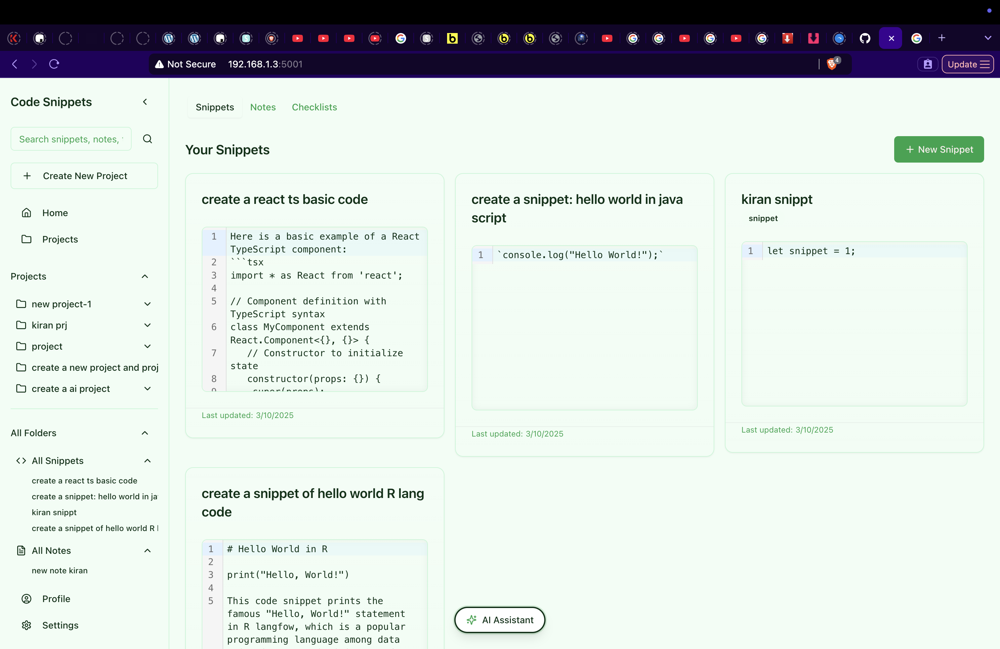
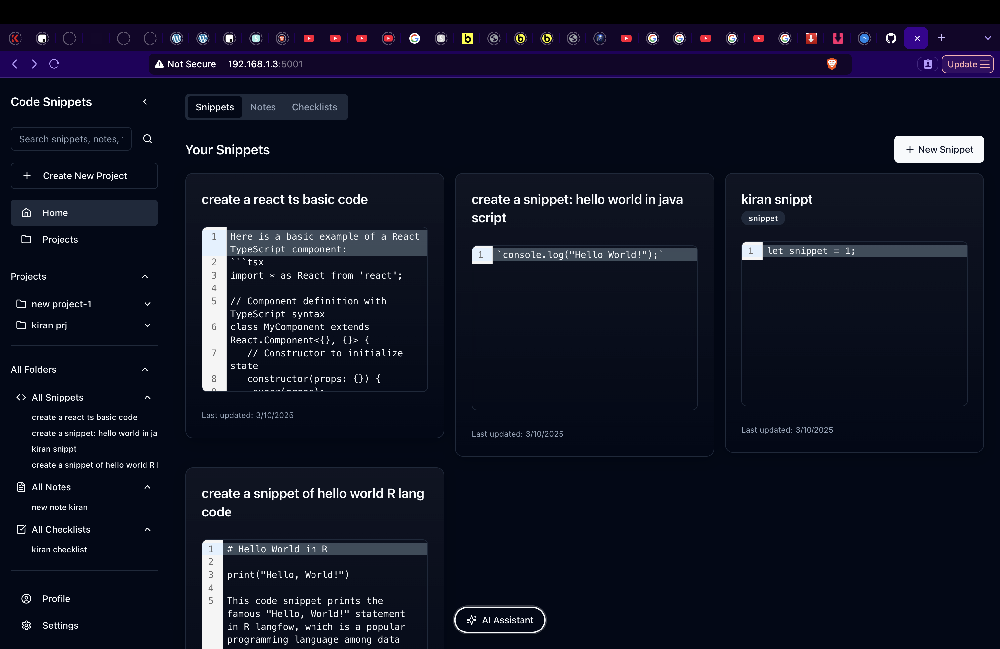
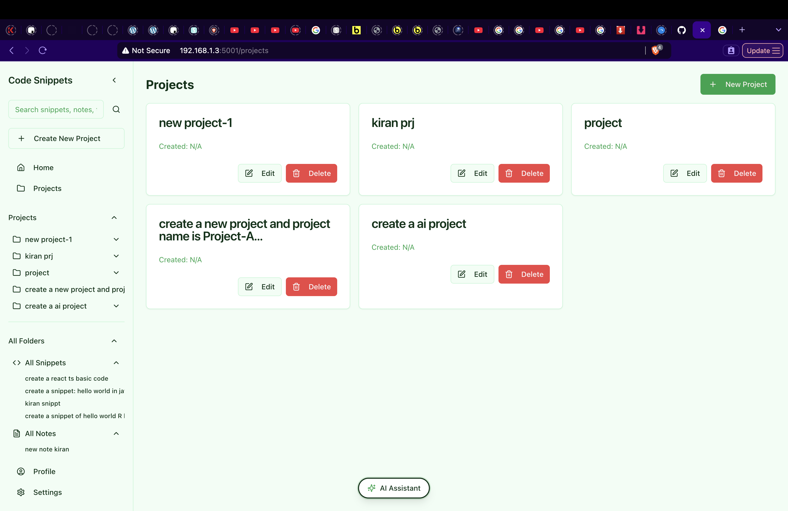
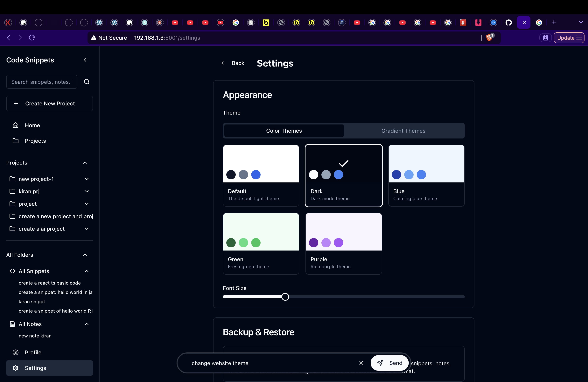
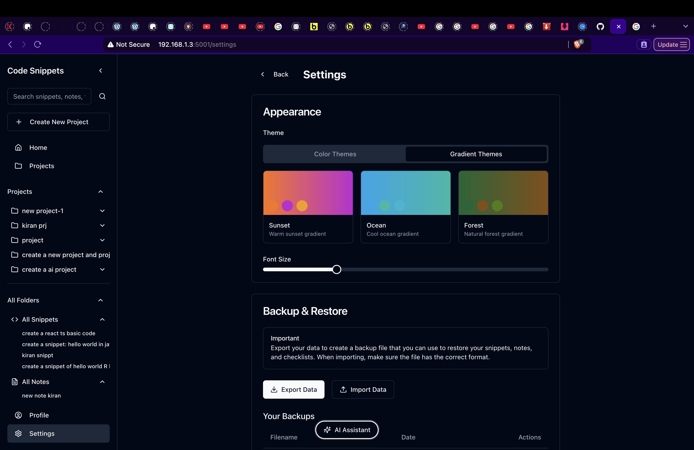
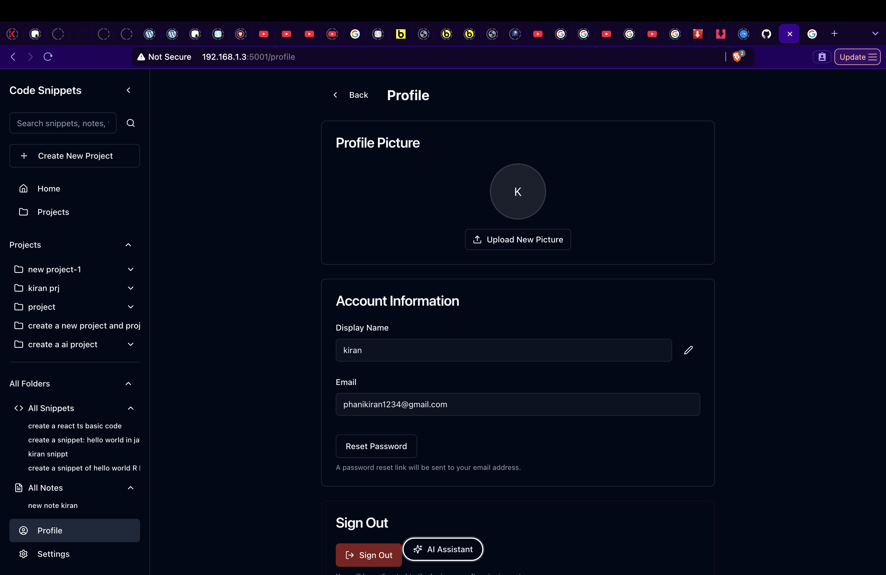
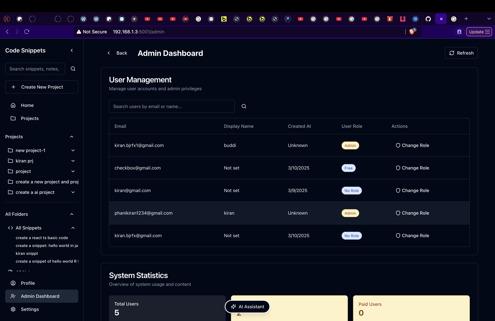
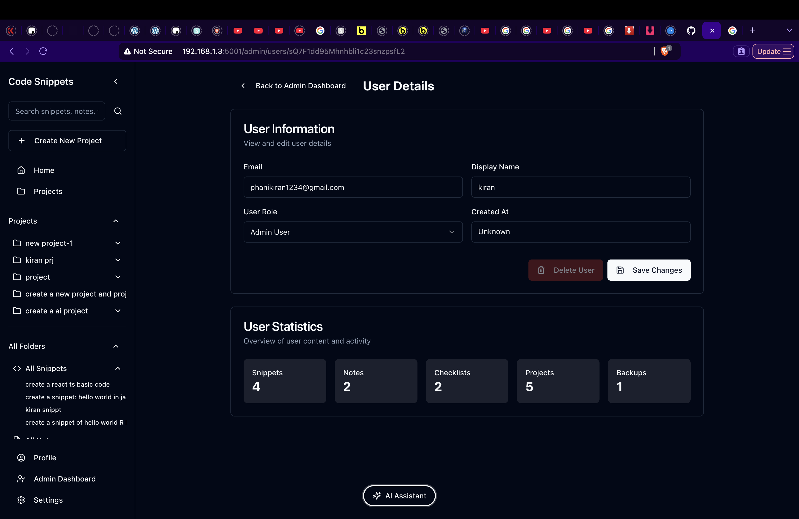
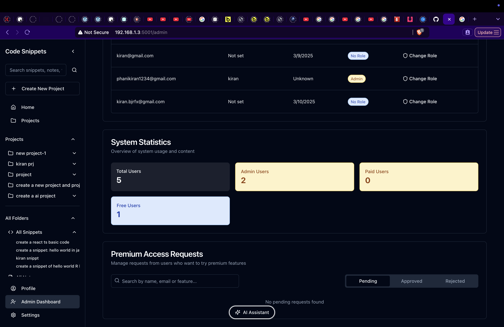

# Code Snippets

A modern web application for managing and organizing code snippets, notes, and checklists with AI-powered content generation capabilities.

**Documentation:** [Visit the Code Snippets full notes](https://bjrfx.github.io/code-snippets) - Comprehensive documentation and usage guides.

**Try it out:** [Live Demo](https://mango-sea-071c1eb1e-preview.westus2.6.azurestaticapps.net/) - Experience the application instantly in your browser.

## Overview

Code Snippets is a full-stack application that helps developers store, organize, and retrieve their code snippets, notes, and checklists. It features a clean, intuitive interface with project organization, tagging, and powerful AI assistance for generating content.




## Features

### Core Functionality

- **Multiple Content Types**: Store and manage code snippets, notes, and checklists in one place
- **Project Organization**: Group related items into projects for better organization
  
- **Tagging System**: Add tags to items for easy filtering and searching
- **User Authentication**: Secure user accounts with Firebase authentication
- **Responsive Design**: Works seamlessly on desktop and mobile devices

### AI-Powered Assistance

- **AI Content Generation**: Leverage Cohere AI to generate:
  - Code snippets in multiple programming languages
  - Detailed, well-structured notes
  - Task checklists
- **Smart Language Detection**: Automatically detects the programming language of generated code
- **Natural Language Processing**: Create content by describing what you need in plain English

### Developer Experience

- **Syntax Highlighting**: Code is displayed with proper syntax highlighting
- **Customizable Settings**: Adjust theme and font size to your preference
  
- **Real-time Updates**: Changes are reflected immediately across the application

## Technology Stack

### Frontend
- React with TypeScript
- Tailwind CSS for styling
- Shadcn UI components
- CodeMirror for code editing
- React Query for state management
- Wouter for routing

### Backend
- Express.js server
- MySQL database
- Drizzle ORM
- JWT authentication
- bcrypt for password hashing

### AI Integration
- Cohere AI API for content generation

## Installation

### Prerequisites

- Node.js (v14 or higher)
- npm or yarn
- MySQL database
- Cohere API key (for AI features)

### Setup

1. Clone the repository:
   ```bash
   git clone https://github.com/yourusername/code-snippets.git
   cd code-snippets
   ```

2. Install dependencies:
   ```bash
   npm install
   ```

3. Configure database:
   Update the MySQL configuration in `server/db.ts` and `drizzle.config.ts`:
   ```typescript
   host: "your_mysql_host",
   user: "your_mysql_user",
   password: "your_mysql_password",
   database: "your_database_name",
   port: 3306
   ```

4. Push database schema:
   ```bash
   npm run db:push
   ```

5. Configure environment variables:
   Create a `.env` file in the root directory:
   ```
   # JWT Secret (change this!)
   JWT_SECRET=your_secure_random_secret_key
   
   # Cohere API Configuration
   COHERE_API_KEY=your_cohere_api_key
   ```

6. Update the Cohere API keys in `client/src/lib/cohere.ts` with your own keys.

## Usage

### Development

Start the development server:

```bash
npm run dev
```

This will start both the backend server and the frontend development server. The application will be available at http://localhost:5001.

### Building for Production

Build the application for production:

```bash
npm run build
```

### Starting Production Server

Start the production server:

```bash
npm run start
```

## Using the AI Features



1. Click on the sparkle icon in the application to open the AI Bar
2. Enter a prompt describing what you want to create:
   - For code snippets: "Create a snippet for sorting an array in JavaScript"
   - For notes: "Write a note about React hooks"
   - For checklists: "Make a checklist for deploying a web application"
3. The AI will generate the content and save it to your account

## Project Structure

```
├── client/               # Frontend code
│   ├── src/
│   │   ├── components/   # React components
│   │   ├── hooks/        # Custom React hooks
│   │   ├── lib/          # Utility functions and API clients
│   │   ├── pages/        # Page components
│   │   └── styles/       # CSS and styling
├── server/               # Backend code
│   ├── index.ts          # Server entry point
│   ├── routes.ts         # API routes
│   └── storage.ts        # Database interactions
└── shared/               # Shared code between frontend and backend
    └── schema.ts         # Data schemas
```

## Contributing

Contributions are welcome! Please feel free to submit a Pull Request.

1. Fork the repository
2. Create your feature branch (`git checkout -b feature/amazing-feature`)
3. Commit your changes (`git commit -m 'Add some amazing feature'`)
4. Push to the branch (`git push origin feature/amazing-feature`)
5. Open a Pull Request

## License

This project is licensed under the MIT License - see the LICENSE file for details.

## User Profile



## Admin Dashboard

### User Management
The admin dashboard provides powerful user management capabilities, allowing administrators to view all users, filter by role, and modify user permissions.



### User Information
Detailed user information is available to administrators, including email, creation date, and current role status.



### Premium Access Requests
Administrators can manage premium access requests, granting temporary or permanent premium status to users.



## Mobile Experience

Code Snippets provides a seamless mobile experience with a responsive design optimized for smartphones and tablets. The mobile interface maintains all the functionality of the desktop version while adapting to smaller screens.

### Key Mobile Features

- **Touch-Optimized Interface**: Easily navigate and interact with your content using touch gestures
- **Bottom Navigation Bar**: Quick access to essential sections of the app
- **Responsive Layout**: Content adapts perfectly to any screen size
- **Progressive Web App (PWA)**: Install on your home screen for app-like experience

### Mobile Screenshots

#### Home Screen
Access your recent snippets, notes, and checklists from the home screen.


#### Projects View
Organize and navigate between your different projects.


#### Search Functionality
Quickly find any content across your entire collection.


#### User Profile
Manage your account and view your statistics.


#### Settings
Customize your experience with various options and preferences.


## Acknowledgements

- [Cohere](https://cohere.ai/) for providing the AI text generation API
- [Firebase](https://firebase.google.com/) for authentication and database services
- [Shadcn UI](https://ui.shadcn.com/) for the beautiful UI components
- [Tailwind CSS](https://tailwindcss.com/) for the utility-first CSS framework